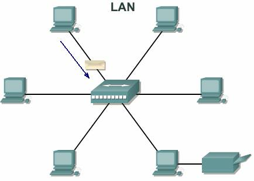

# Programacion Paralela y Distribuida

## Unidad 1

## Practica N°1 - Unidad

#### Martin Farres - 13495

### Ejercicio 1

#### Middleware

El middleware es un programa informático que permite uno o varios tipos de comunicación o conectividad entre aplicaciones o componentes de una red distribuida, creando esencialmente un "pegamento de software" que une sistemas diferentes.

#### Red LAN (Local Area Network)

Una red LAN es una red informática cuyo alcance se limita a un espacio físico reducido, como una casa, un departamento o a lo sumo un edificio. A través de una red LAN pueden compartirse recursos entre varias computadoras y aparatos informáticos.

### Ejercicio 2

#### Ejercicio 9: ¿Qué es la ciencia computacional? ¿En que se diferencia de las Ciencias de la Computación?

La ciencia computacional es la relacion interdiciplinaria entre las ciencias de la computacion, las mamtematicas y la ciencia experimental para resolver problemas complejos en diversas áreas de la ciencia, ingeniría, medicina, economia, entre otras.

Mientras que la ciencias de la computación no presenta dicho origen interdiciplinario, con lleva un enfoque teórico en los fundamentos y teorías de la computacion, y su objetivo principal es el de desarrollar, entender y aplicar los fundamentos de la computación. Mencionar que las áreas de estudio de las Cs.Comp. son los algoritmos, estructuras de datos, sistemas complejos, arquitectura de computadoras, entre otras.

#### Ejercicio 10: ¿Qué se plantea en la Ley de Moore?¿Se sigue cumpliendo?

La ley de moore plantea que aproximadamente cada 2 años la cantidad de transistores dentro de un microprocesador debería duplicarse. Sin embargo, en los últimos años se ha visto que tal relación lineal se ha roto siendo cada vez mas cercano a una relacion exponencial, sin incluir las apariciones de los primeros prototipos de computación cuantica que romperían con todo el paradigma y arquitectura de los microprocesadores actuales.
